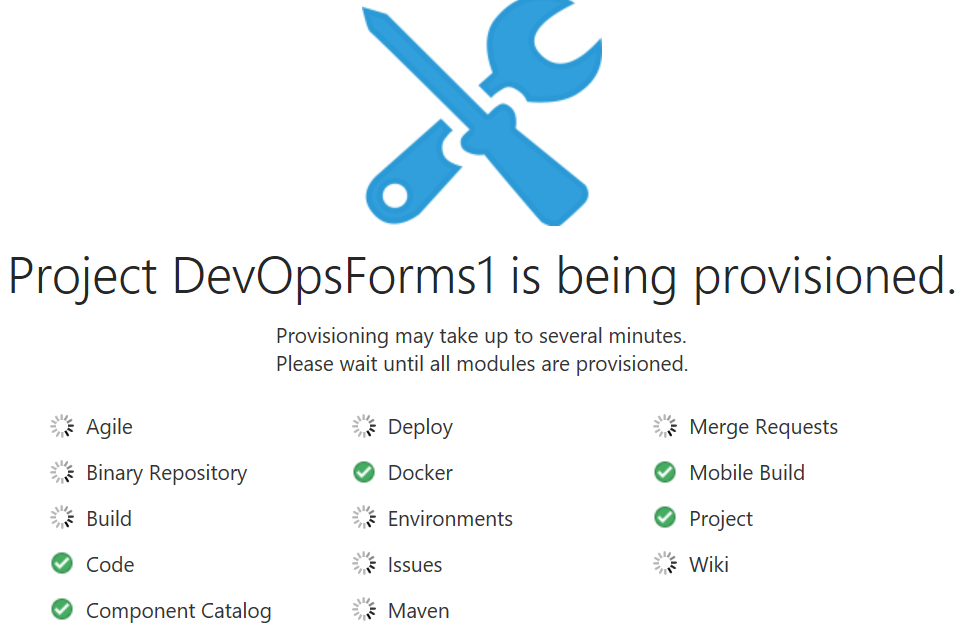
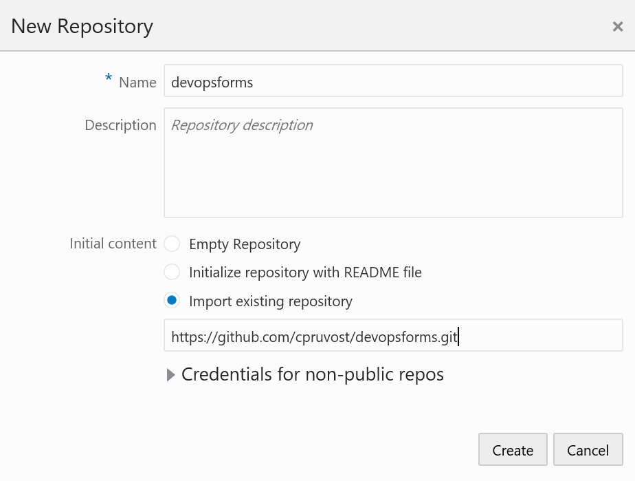
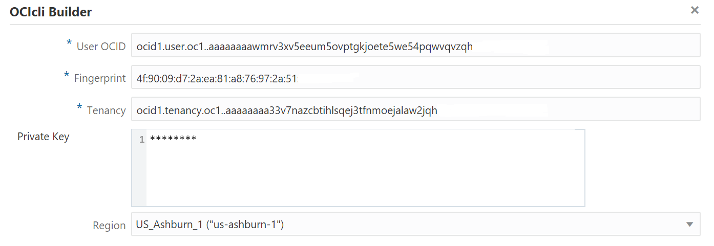
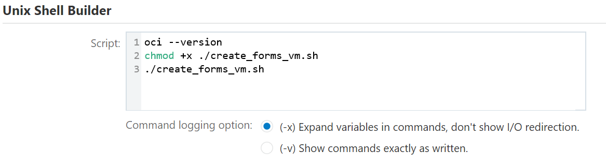
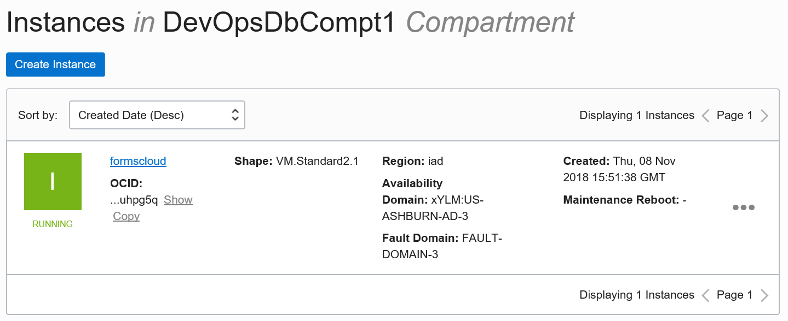

# Create Forms VM

## Import the Forms Target Cloud Image in your Cloud Account

Import the image "formstarget" like you do in the Workshop Db. The public url is [this one](https://objectstorage.us-ashburn-1.oraclecloud.com/p/xhOkLfLCuzzN9zKDqdJ61Mn9MBavdagEzlIV3znA8dE/n/gse00014557/b/LASC_FORMS/o/LASC_Cloudform)


## Create your env in Developer Cloud Service

On the Oracle Cloud Web Console, go on the dashboard and then in Developer Cloud Service. You have to create an Instance (ex : DevOpsDb). 

In order to speed up your work, if you are with Oracle people, we created it for you so you just click on the right menu "Access Service instance".

Now create an Empty Private Project called "DevOpsFormsx". Update the number in the name according to your user number (ex : DevOpsForms1 if you are user1.devops). It takes 2 minute to get  it.



## Create your git repository

So in Developer Cloud Service on your  project (ex DevOpsForms1) you have to create a git repository named "devopsforms". Click on "New Repository" and choose to import the devopsdb forms github repository.

 

## Clone the source code in the DevOps VM

So you have to use the Devops Db VM of the workshop Devops Db. 

First connect with putty to the Devops Db VM then clone the devopsforms git repository. Click on devopsforms.git in DevCS then you will have a button clone where you will fond the git url. You will be asked for your cloud account password.

```shell
git clone https://user1.devops%40gmail.com@devopsdb-gse00014392.uscom-central-1.oraclecloud.com/devopsdb-gse00014392/s/devopsdb-gse00014392_devopsforms1_6682/scm/devopsforms.git
```

 Now you can go in the directory "devopsforms" and you have to update the env-vars file with the good values

```shell
export region="xYLM:US-ASHBURN-AD-x"
export compartment_ocid="ocid1.compartment.oc1.xxxxxx"
export shape="VM.Standard2.2"
export image_id="ocid1.image.oc1.xxxxxx"
export subnet_id="ocid1.subnet.oc1.iad.xxxxxx"
export public_key_path="./SshKeys/formr.pub"
export db_ip_address="129.213.xxx.xxx"
export db_service_name="aTFdb.xxxxxxxxxxx"
```

region : choose the same region as your Db.

compartment_ocid : use the ocid of the compartment you used before in the DevOps Db Workshop (ex : DevOpsDbCompt1 ).

shape : choose a shape in relation with your permissions on the Cloud Oracle (ask Oracle people if you are with them).

image_id : look at the ocid of the forms target image imported before.

subnet_id : choose the same VCN of your Database and take the same subnet as your Db.

db_ip_address : choose the public Ip of your Db (it is a workshop, we use a public ip to go faster, but it is an anti-pattern sure).

Now you commit your code and push it to your DevCS git repository. You will be asked for the password of your cloud account.

```shell
git status
git add env-vars
git commit -m "my new env-vars"
git push origin master
```
## Create the Job "Create Forms VM"

You will use OCI CLI to do that.

In DevCS you create a new Job (Build Menu). The name of the job is "Create_Forms_VM".  Like before in DevOps Db workshop you add a git source control (it is your devopsforms.git) and you add an OCIcli Builder and a Shell Unix Builder like below (in OCIcli Builder use the good values of your Oracle Cloud Account)



Now you can run the Job. At the end you will see your Forms VM in the Cloud Console.

