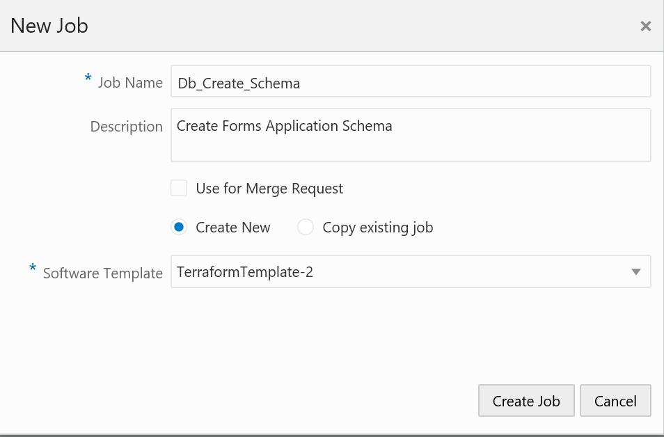
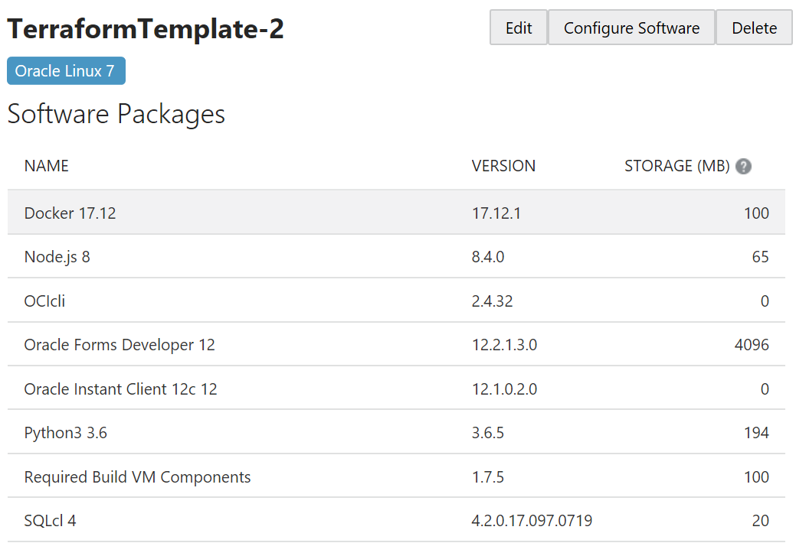

# Import Application Schema in Database

## Create the Schema "Summit"

First create a new job "Db_Create_Schema".



In the Source Control add the devopsforms.git as usual.

Then add a Unix Shell Builder like below :

```shell
source ./env-vars
export DBUSER="system"
export SLACH="/"
export DBPASSWORD="BEstrO0ng_#11"
cd ./Schema
echo "db_ip_address = $db_ip_address" 
echo "db_service_name = $db_service_name" 
echo "pdb_service_name = $db_service_name" 
./create_schema.sh
```

Look at the file "create_schema.sh" in order to understand the code (it is very simple).

Now Run the job and check that all is OK using Oracle SQL Developer (so you have to create a new connection to the schema summit in Oracle SQL Developer).

## Import Data in Schema "Summit"

In this part we have to import a dump file "workshop_summit_schema.dmp" so we need the "imp" executable.

For the moment we can install in the Build VM Template the "Oracle Instant client 12cR1" but the imp/exp and impdb/expdb executables are only in the "Oracle Instant client 12cR2+" so it will not solve our problem.

How to solve this problem ? the answer is very simple. We are going to use docker.

So the first step is to create a docker image with the "Oracle Instant client 18c" (remember 18c is the name for 12cR2+ ..:o)... ). In order to go faster we have already build the Docker image to use (cpruvost/devopsforms) but if you want to build your image you can just use the Dockerfile we put in the docker repository. The Docker file is very simple.

```shell
#
# Dockerfile template for Oracle Instant Client
#
# HOW TO BUILD THIS IMAGE
# -----------------------
# Put all downloaded files in the same directory as this Dockerfile
# Run: 
#      $ docker build -t oracle/instantclient:18.3.0 . 
#

FROM oraclelinux:7-slim

RUN  curl -o /etc/yum.repos.d/public-yum-ol7.repo https://yum.oracle.com/public-yum-ol7.repo && \
     yum-config-manager --enable ol7_oracle_instantclient && \
     yum -y install oracle-instantclient18.3-basic oracle-instantclient18.3-devel oracle-instantclient18.3-sqlplus oracle-instantclient18.3-tools && \
     rm -rf /var/cache/yum && \
     echo /usr/lib/oracle/18.3/client64/lib > /etc/ld.so.conf.d/oracle-instantclient18.3.conf && \
     ldconfig

ENV PATH=$PATH:/usr/lib/oracle/18.3/client64/bin
ENV TNS_ADMIN=/usr/lib/oracle/18.3/client64

CMD ["sqlplus", "-v"]

```

So now create a new job "Db_Import_Data".

In the Source Control add the devopsforms.git as usual.

Then add a Unix Shell Builder like below :

```shell
source ./env-vars
export SLACH="/"
export DBUSERSUMMIT="summit"
export DBPASSWORDSUMMIT="AlphA_2014_"
cd ./Schema
chmod +x ./create_tables.sh
echo "db_ip_address = $db_ip_address" 
echo "pdb_service_name = $pdb_service_name" 
./create_tables.sh
```

Loot at the code in order to understand. You can see that we use the docker image "cpruvost/devopsforms" in order to do the import of the dump.

So before running we must add "Docker" in the Build VM and so we have to update the template of the Build VM. Do that part as you do in the previous workshop. below you can see Docker 17.12 in the template.




Now Run the job. Due to the template update the Build VM will restart so it takes some minutes. After  check with Oracle SQL Developer that all is OK. So just refresh the connection "Summit" and look at tables.