# Do the configuration of Forms Application

Sure we can automate this part as we do with all the steps before or just by using a Forms VM Image where the configuration of the application is already done. Nevertheless in order to do this lab I started from an Oracle lab "Lift And Shift of Forms to OCI" so to go faster I prefer to do this step manually like in this lab, knowing that this step must be done only 1 time.

## Configure the tnsnames.ora

Log with Putty in the Forms Cloud VM with opc.

Change as user oracle.

```shell
sudo -s
su - oracle
```

Check the tnsnames.ora  

```shell
cat /app/oracle/Middleware/Oracle_Home/user_projects/domains/forms_domain/config/fmwconfig/tnsnames.ora
```

Now update the PDBORCL connection with the good values coming from your database.

Check with tsnping

```shell
export TNS_ADMIN= /app/oracle/Middleware/Oracle_Home/user_projects/domains/forms_domain/config/fmwconfig
. oraenv (enter ORCL)
tsnping PDBORCL
```
## Use Enterprise Manager Middleware Control

First use a browser to connect  to the url of EM (http://public-ip-forms-cloud-vm:7001/em). 

In order to connect use : weblogic/F@ndRWks1p#

If the browser does not open the welcome screen it means that the 7001 port in not opened through the firewall. We should open this port using OCI CLi in the first step of this lab. Heum....I forgot that point so let's go in the Cloud Console and update the ingress rule of the security rule used by the Virtual Cloud Network of your VM.

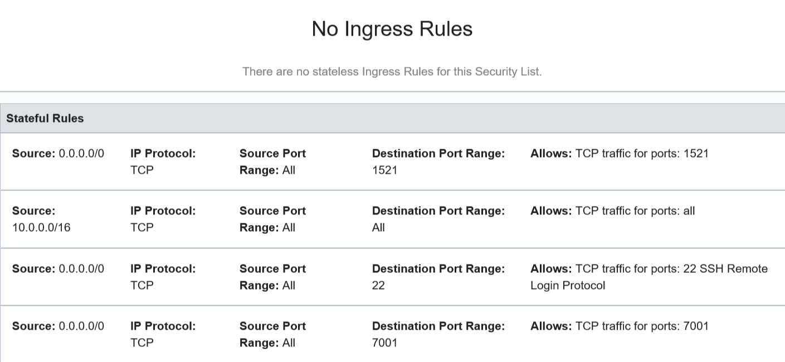 

In the Web Console **Click** on the **master** **menu** to the *left* of  **“***forms_domain***”.**

From the Target Navigation menu

·       Expand the **“Forms”** branch

·       Select “**forms1”**

*This can be a little confusing – please follow instructions \***carefully**


From the Forms menu choose the “**Environment Configuration**” item. Select ‘**Lock & Edit’** from the *lock menu* on right hand side..

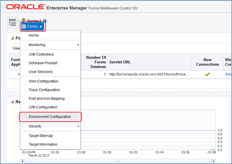

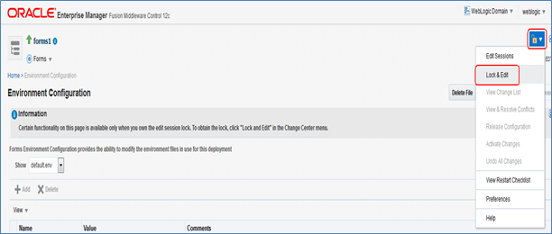

Click on the “**Duplicate File**” button. In the Duplicate File popup:

Select **default.env** for Environment File.
Enter **summit.env** for Name.

 Click on **Duplicate**.

Click **OK**

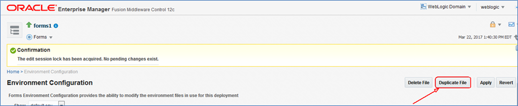

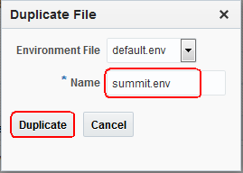

Choose the new environment config ‘**summit.env’** from the *Show* drop down on the left.

Check that you are still in lock mode. 

If not select ‘**Lock & Edit’** again from the lock menu. 

In the FORMS_PATH value, append the following to the end.

  **:/app/deploy/Summit** 

Click **Apply** button to save the changes.

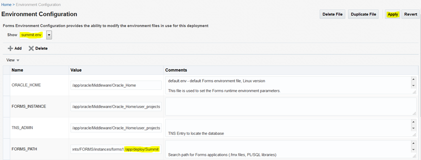

Choose “**Web Configuration**” from the Forms menu.

Click on ‘**Create Like**’. On left hand side

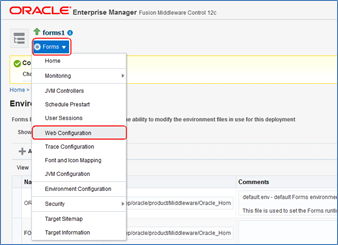

In the Create Like popup:

Choose **default** for Section To Duplicate.

Enter **summit** in the New Section Name.

 Click on **Create** button.

 In the Confirmation window, click on **Close**

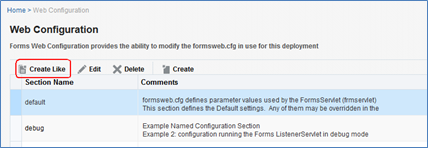

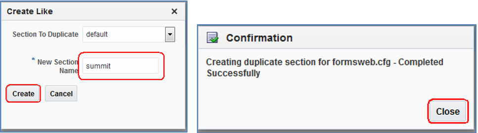

Scroll down the page to the **Section:summit** region.

Select “**all**” from the ‘Show’ drop down box on left.

Complete the following fields, scrolling down as needed:

·       envFile: **summit.env**

·       form: **customers.fmx**

·       userid: **summit/summit@PDBORCL**

·       separateFrame : **true**

·       archive: **frmall.jar,summit.jar, demo.jar,icons.jar**

 Click  “**Apply**” (scroll up, this is not at top but level with the ‘Section’ Drop down box).

Click **Close** in the Confirmation window

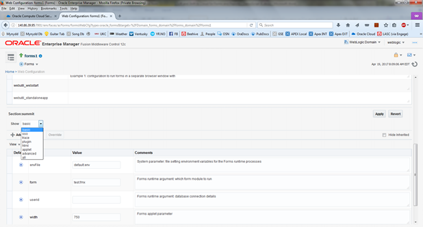

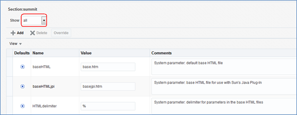

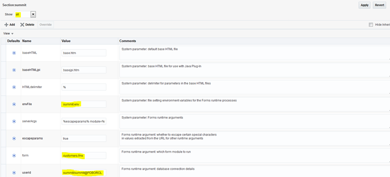

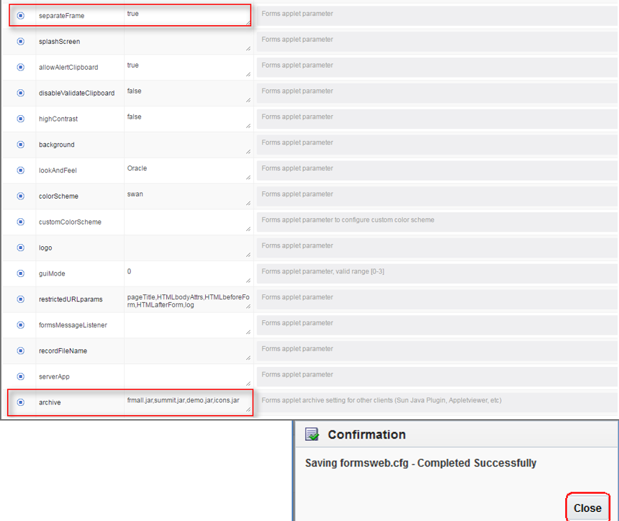

From the lock menu on top right.

Choose “**Activate Changes**”

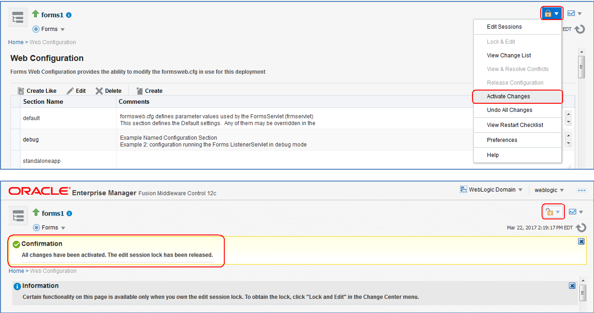

Run and test the deployed app in the cloud. Do not forget to open the 7777 port as you do for the 7001 port before.

 Copy the following URL in the old Internet Explorer (other browsers do not support plugins)
 **http://<ip-addr>:7777/forms/frmservlet?config=summit**

**But replace** *<ip-addr>* with the Public IP value of the **‘formscloud’** instance.  

**Open** the URL from a browser on your laptop.

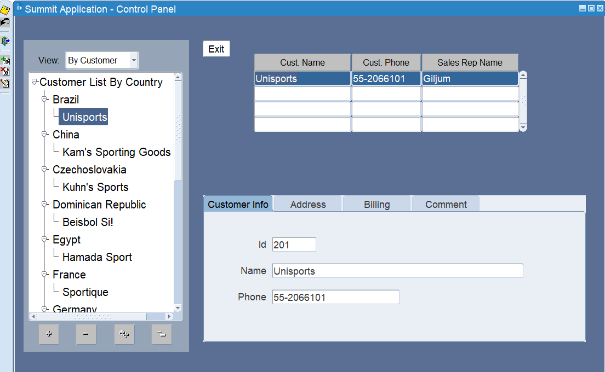