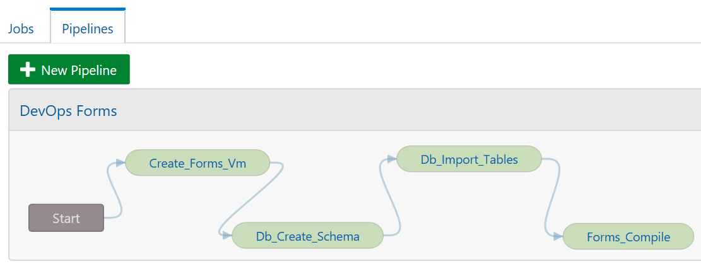

# Create the pipeline in Developer Cloud Service

In the Oracle Cloud Web Console click on Build Menu then click on Pipeline.

Create a new pipeline "DevopsForms" like below :

Then click on build on the rigth top of the pipeline. Then you will see all the jobs running from start to end. Nothing new will happen sure because all the steps are already done :o).
